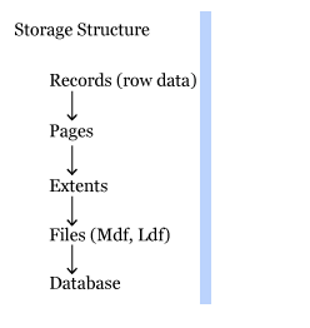

## SQL SERVER ARCHITECTURE:  STORAGE ENGINE 

https://codingcompiler.com/sql-server-dba-tutorial/

Storage Architecture & Internals - https://www.youtube.com/watch?v=SGmuoPF_MHQ

## Storge Engine:

Using the execution plan, data required will be fetched and executed accordingly to the user .

In sql server all the data will be stored in the form of records, these records also called as row data. All these records further grouped into a page.
	Page is a default storage unit of sql server. The size of page is 8kb.

Page Architecture:

### Data Page:
***********

SQL Server - **Data Pages** <[SQL Server Quickie #1 - Data Pages](https://www.youtube.com/watch?v=o5Pf5FHJHyU)>
Data in SQL Server is stored inside Data pages. Each Data page is 8 KB size.

Page consists of 3 sections,

 **Page Header (96 Bytes)**

 **Actual Data / Payload** : stores data/records

 **Row offset array** : details of where each data / record is placed. 

	**Page Header** – It consists of Page ID, Page Type, Object ID Header version.
	**Page ID** – To identify particular page using unique page ID.
	**Page Type** – What type of page it is either data page or Index page.

 In Row offset location of record will be stored (2 bytes).

**Types of Pages:**

	**Data Page** – stores data entered by user.
	**Index Page** – Indexes are pointer which store address of original pages for quickly locating data
	**Free space page** – It stores page allocation information and unused space available on pages.
	**Text/Image** – It stores large object data (LOB) like Text, Image and XML Data.
	**GAM (Global Allocation Map) or SGAM (Shared Global Allocation Map)** – It stores extent allocation information.
	**BCM (Bulk Changed Map)** – Stores extents information in a Bulk Operation
	**DCM (Differential Change Map)** – It stores modified extents information after Full BackUp.
	**I AM (Index Allocation Map)** – Stores extents information that are used by a table (or) Index.
	These are important types of pages. All these pages are further grouped into Extent.

**SQL Server Extents:**

	Extent is a storage structure consists of 8 consecutive SQL Server pages. Pages in a Extent can be one table (or) upto Eight tables.
	
	There are 2 types of Extents
	
	**Uniform Extent**: If all pages are going to store same table data
	**Mixed Extent**: If the pages shared by 2 (or) more tables.
	
	When a table is created and a row is inserted table gets 1 page in mixed extent, when a table grows then these tables moved to uniform extent. This is to manage space efficiently.

**SQL Server File**

	All the extents further group into a File. A file we will have better control in SQL Server.
	There are 2 types of files mainly,
	
		1. MDF (Master Data File)
		2. LDF (Log Data File)
	
	MDF – Stores Permanent Data
	LDF – Stores changes information will be recorded later this changes apply on MDF Data.

**SQL Server Database**

	Files combine to form database. We require minimum 2 files 1 MF and 1 LDF to create a database. Maximum we can ‘n’ number of files means No limit.

	**File Groups**
	Some files stored system data and some store user database data. Logically dividing databases into groups called File Groups.

*** DATABASE ARCHITECTURE***

	SQL Server data mainly in 2 types of files,

		1. Data File (MDF)
		2. Log File (LDF)

	Data file stores actual data with .mdf extension. It stores permanent data.

	Log files stores modified recorded information with .ldf extension.
	
	We have another file called secondary data file .ndf file extension. A database may or may not have these secondary data files.
