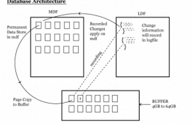

SQL Server Storage Architecture
    SQL Server stores data mainly in two types of files.
    
            1. Data File (MDF)
            2. Log File (LDF)

            

MDF  – It contains Permanent Data
LDF – LDF contains whatever changes we are performing on database all the change related information will be recorded in LDF file.

